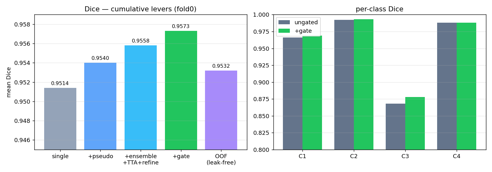
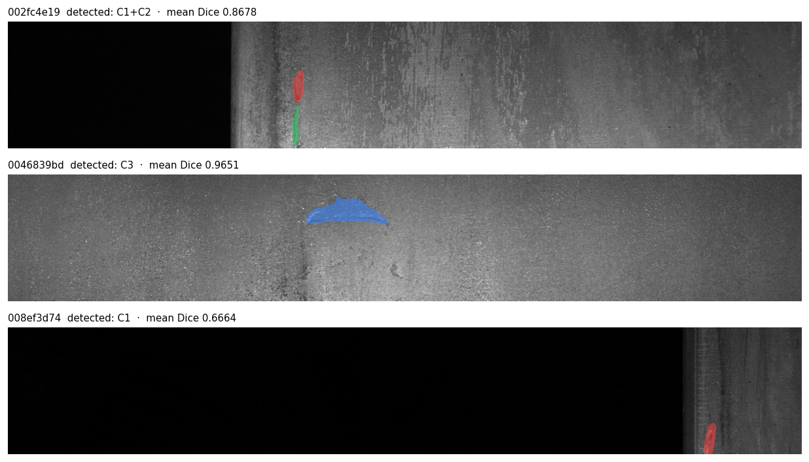
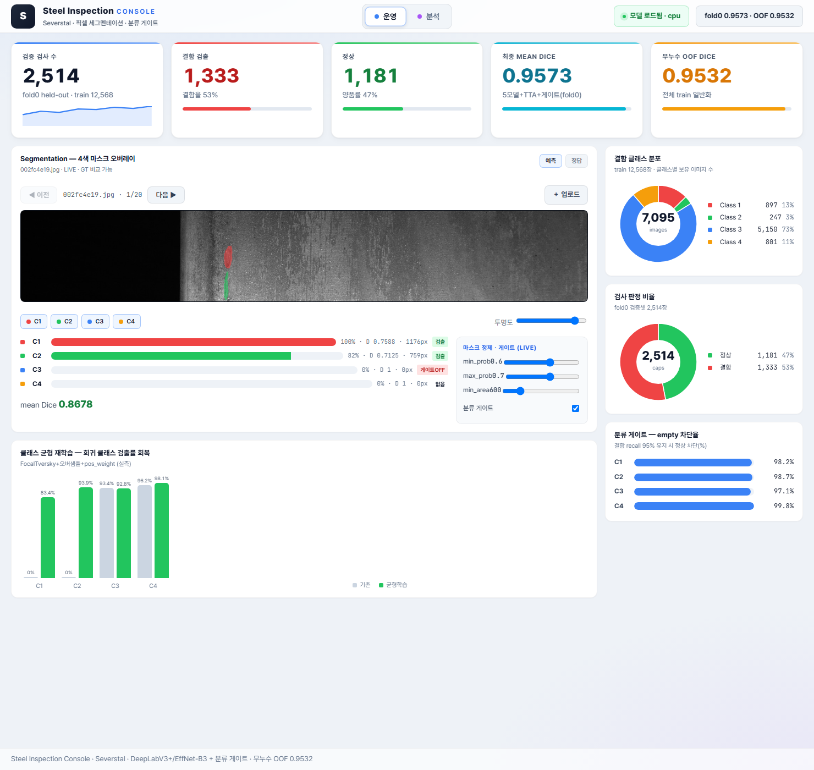
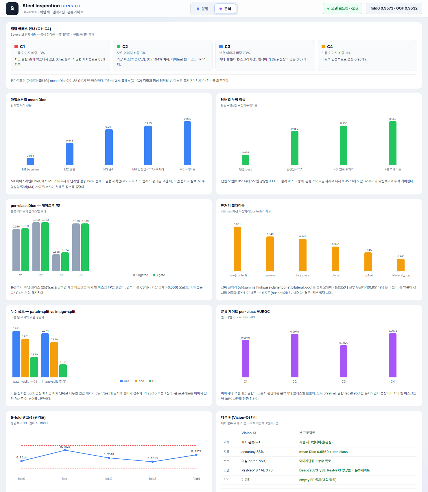

# Steel Defect Inspection Suite — Severstal

강판 표면결함을 픽셀 세그멘테이션으로 검출·분류·위치화하는 검수 시스템.
[Severstal Steel Defect Detection](https://www.kaggle.com/c/severstal-steel-defect-detection)(Kaggle) · 12,568장 256×1600 · 결함 4종 · 멀티라벨.

**라이브 데모(콘솔)**: https://maxwell779.github.io/steel-defect-suite/
*(GitHub Pages · 정적 — 사전계산 20샘플·전체 차트·해설·GT 비교. 업로드 LIVE 추론은 Docker로 백엔드 실행 시)*

대회 평가지표는 **(이미지×클래스) mean Dice**다. 데이터의 85.9%가 빈 마스크라, 결함을 잘 그리는 것만큼 **정상 영역에 마스크를 안 그리는 것(빈 마스크 FP 억제)** 이 점수를 좌우한다. 기존 KDT 팀은 이 과제를 256×256 패치 이진분류로 바꿔 풀었는데, 본 프로젝트는 원래 과제인 세그멘테이션으로 풀고 이미지단위 fold로 누수를 통제했다.

## 결과

| 항목 | mean Dice |
|---|---|
| 단일 모델 (DeepLabV3+/EffNet-B3, BCE-Lovász) | 0.9514 |
| + pseudo-label (test 미라벨 → train, 2라운드) | 0.9540 |
| + 5모델 앙상블 · TTA · 3-임계 마스크 정제 | 0.9558 |
| + 분류 게이트 (빈 마스크 억제) | **0.9573** |
| 5-fold OOF (전체 train, 누수 없는 일반화 추정) | **0.9532** (fold 편차 ±0.001) |

- 분류 게이트(멀티라벨 EfficientNet-B3): AUROC 0.9954, 결함 recall 95% 유지 시 정상 이미지 약 98% 차단.
- 위 수치는 train 이미지단위 held-out fold 기준이다. 대회 test 라벨은 비공개라 공개 리더보드(private ~0.90–0.918)와 동일 조건 비교는 아니다.



세그멘테이션 예측 예시 — 4색 마스크 오버레이(C1 빨강 / C2 초록 / C3 파랑 / C4 노랑):



## 접근

| 단계 | 내용 |
|---|---|
| 0 | 패치분류 재현 — patch-split vs image-split 점수차로 누수 영향 측정 |
| 1 | 분류 게이트 — EfficientNet-B3 멀티라벨 4-logit, 빈 이미지/클래스 억제 |
| 2 | 세그멘테이션 — smp DeepLabV3+/FPN/UNet × {effb3, se_resnext50} 앙상블 + BCE-Lovász + TTA + 3-임계 마스크 정제 |
| 2.5 | 클래스 균형 재학습 — FocalTversky + 오버샘플 + pos_weight |
| 2.6 | pseudo-label — test 미라벨 2라운드, train fold에만 추가(val 격리) |
| 3 | 무라벨 이상탐지(보조) — ReconPatch/PatchCore |

초기 mean Dice 0.93을 빈마스크 억제 / 결함 검출 / 분할 품질로 분해해 보니 희귀 클래스 C1·C2의 실제 검출률이 0%였다(높은 Dice는 빈 마스크를 비워서 나온 값). 균형 재학습으로 C1·C2를 83%/94%로 회복했다. 이후로 mean Dice 단독이 아니라 per-class 검출률을 함께 본다.

## 효과를 본 것 / 못 본 것

- **누수**: 50%-overlap 패치를 patch-split하면 인접 패치가 train/test에 동시에 들어가 image-split 대비 +1.25%p 부풀려졌다. 이미지단위 fold로 고정.
- **전처리**: DoG/CLAHE 등 상위 전처리 5종을 승자 모델에 적용했으나 전부 무전처리(0.9514) 미달. 지도 세그에서는 큰 백본이 전처리 이득을 흡수해 도움이 안 됐다(비지도 busbar에서는 반대였음). 원본 입력 사용.
- **pseudo-label**: 2라운드로 0.9514 → 0.9540 (+0.0026), 특히 C3(대형/스크래치) 검출이 개선.
- **무라벨 이상탐지**: ImageNet 특징 기반 PatchCore-lite는 AUROC ~0.45로 작동하지 않았다(블랙보더·노출 등 도메인 아티팩트가 미묘한 결함 신호를 덮음). 타팀 Conv-AE도 0.70에 그쳤다. 이 도메인은 지도 세그가 맞다.

## 데모 — Steel Inspection Console ([web/](web/))

라이브: https://maxwell779.github.io/steel-defect-suite/ · FastAPI 추론 백엔드 + React(Vite) 콘솔. 라이트 테마, 차트는 외부 라이브러리 없이 SVG/CSS로 직접 구현. 2개 모드.

**운영 모드** — KPI + Segmentation viewer(4색 마스크 오버레이, GT/예측 토글, 클래스 on/off, 투명도, 마스크 정제·게이트 슬라이더 LIVE, 이전/다음 20샘플) + 클래스 분포·판정 비율 도넛 + 균형학습 검출률 + 게이트 차단율



**분석 모드** — 결함 클래스 안내(C1~C4) + 차트 8종(마일스톤 Dice·레버 이득·per-class 게이트 전후·전처리 교차검증·누수 폭로·게이트 AUROC·5-fold 관리도·타팀 대비)에 각각 실험 해설



모든 차트는 실측 결과(`experiments.json`·`dashboard.json`) 기반.

```bash
# 추론 백엔드 (CPU)
STEEL_DEVICE=cpu python -m web.precompute_samples       # 최초 1회
STEEL_DEVICE=cpu uvicorn web.server:app --port 8010
# 개발: cd web/ui && npm install && npm run dev          # http://localhost:5174 (/api,/static → 8010 프록시)
# 배포: cd web/ui && npm run build → web/server.py 가 dist를 / 에 서빙
```

## 배포

Docker (백엔드 + 빌드된 콘솔 dist 포함):
```bash
docker build -t steel-console .
docker run -p 8010:8010 -v "$PWD/experiments:/app/experiments" steel-console   # http://localhost:8010
```
가중치(`experiments/`)가 없으면 사전계산 샘플로 폴백 동작한다.

## 구조

```
src/   data · eda · train_seg · train_clf · sweep · cross_preproc · postprocess
       gated_eval · oof_gated_eval · pseudo_label · recon_patch · metrics
web/   infer · server + static(index / app.js / experiments.json / samples)
docs/  STRATEGY · PRD · RESULTS · EDA  (+ overnight/*.json)
```

- 학습: PyTorch · segmentation_models.pytorch · timm · Albumentations (A100, AMP)
- 평가: 이미지단위 GroupKFold, threshold는 val에서만 결정, per-class Dice·AUROC·empty FP율

## 재현

```bash
pip install -r requirements.txt
# 데이터: Kaggle에서 받아 data/ 에 (train.csv, train_images/, test_images/)
python -m src.eda
python -m src.train_seg --arch deeplabv3plus --encoder efficientnet-b3 --loss bce_lovasz --oversample --posweight 4,8,1,2
python -m src.train_clf --encoder efficientnet_b3
python -m src.gated_eval --tta
```
데이터·가중치는 레포에 포함하지 않는다(`.gitignore`).

## 문서

- [STRATEGY.md](docs/STRATEGY.md) — 타팀 분석, 대회 SOTA 조사, 전략
- [PRD.md](docs/PRD.md) — 비전, 성공기준, 아키텍처, 화면, 로드맵
- [RESULTS.md](docs/RESULTS.md) — 단계별 결과, ablation, 최종 요약
- [EDA.md](docs/EDA.md) — 클래스/면적/멀티라벨/공간분포/fold
