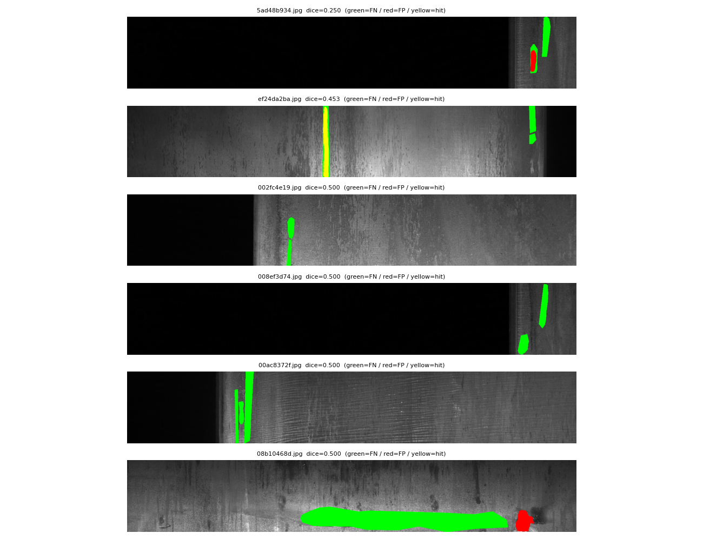

# 세그 모델 심층 분석 (fold0, UNet/se_resnext50)

> 대회 Dice를 **빈마스크 억제 / 결함 검출 / 분할 품질**로 분해. thr=0.5, min_size=800.

## 1. 클래스별 Dice 분해
| 클래스 | mean Dice | 빈마스크 억제율 | empty FP | 결함 검출률 | 결함 FN | 검출분할 품질 |
|---|---|---|---|---|---|---|
| C1 | 0.928 | 100.0% (2333) | 0 | 0.0% (181) | 181 | 0.000 |
| C2 | 0.981 | 100.0% (2465) | 0 | 0.0% (49) | 49 | 0.000 |
| C3 | 0.846 | 95.7% (1485) | 64 | 93.4% (1029) | 68 | 0.733 |
| C4 | 0.983 | 99.9% (2354) | 2 | 96.2% (160) | 6 | 0.775 |

→ 전체 mean Dice **0.9343**. **해석**: 빈마스크 억제율(=점수의 86% 차지)이 대부분 높고, 결함 검출률·분할 품질이 클래스별 천장을 가른다.

## 2. 최난 이미지 (평균 Dice 최저 10)
| ImageId | 평균 Dice | per-class |
|---|---|---|
| 5ad48b934.jpg | 0.250 | [0.0, 0.0, 0.0, 1.0] |
| ef24da2ba.jpg | 0.453 | [0.0, 0.0, np.float64(0.81), 1.0] |
| 002fc4e19.jpg | 0.500 | [0.0, 0.0, 1.0, 1.0] |
| 008ef3d74.jpg | 0.500 | [0.0, 0.0, 1.0, 1.0] |
| 00ac8372f.jpg | 0.500 | [0.0, 0.0, 1.0, 1.0] |
| 08b10468d.jpg | 0.500 | [1.0, 1.0, 0.0, 0.0] |
| 0934b8bff.jpg | 0.500 | [0.0, 1.0, 0.0, 1.0] |
| 0c59df320.jpg | 0.500 | [0.0, 1.0, 0.0, 1.0] |
| 0f010cc60.jpg | 0.500 | [0.0, 1.0, 0.0, 1.0] |
| 112942aed.jpg | 0.500 | [0.0, 0.0, 1.0, 1.0] |

## 3. 임계(thr) · min-size 민감도
| thr | min_size | mean Dice |
|---|---|---|
| 0.3 | 0 | 0.9314 |
| 0.3 | 800 | 0.9343 |
| 0.3 | 1500 | 0.9344 |
| 0.5 | 0 | 0.9317 |
| 0.5 | 800 | 0.9343 |
| 0.5 | 1500 | 0.9338 |
| 0.7 | 0 | 0.9314 |
| 0.7 | 800 | 0.9333 |
| 0.7 | 1500 | 0.9334 |

## 4. 최난 이미지 시각화

초록=GT 놓침(FN) / 빨강=오검출(FP) / 노랑=정확. 남은 오류 양상 확인용.
