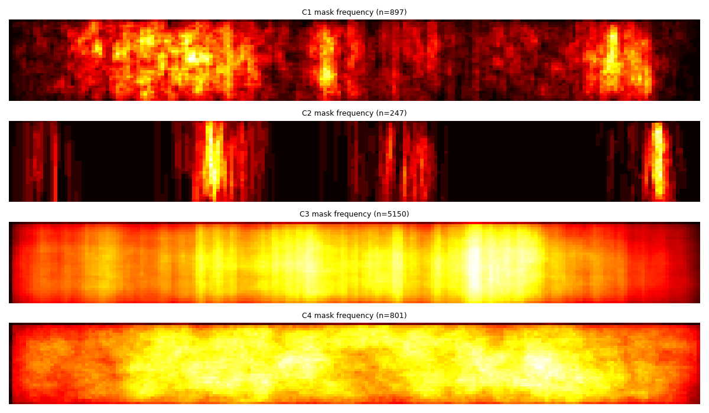
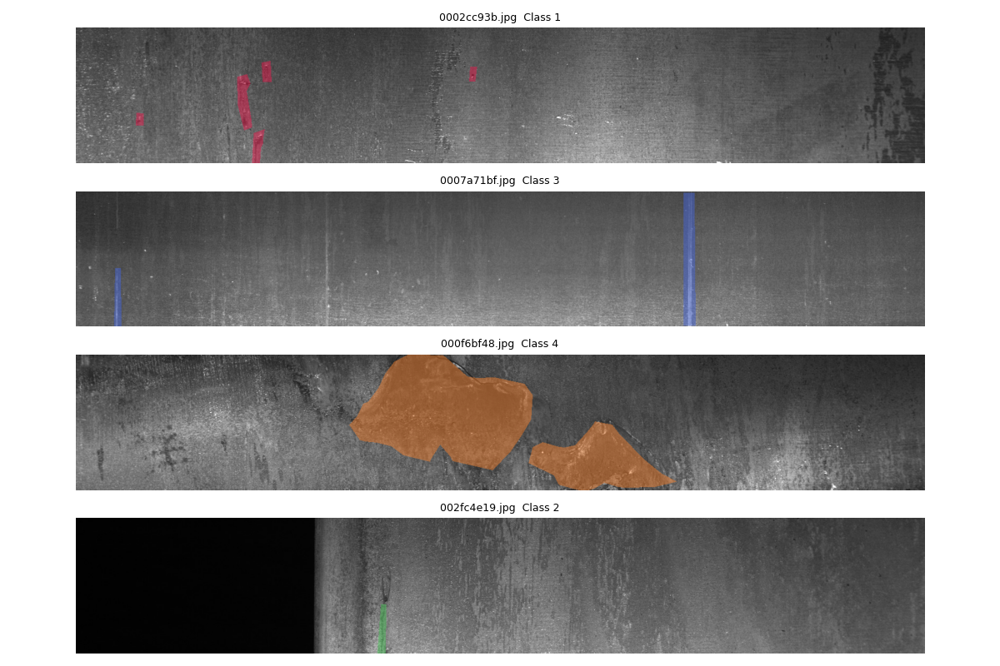
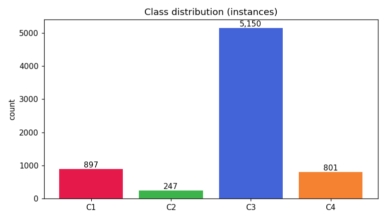
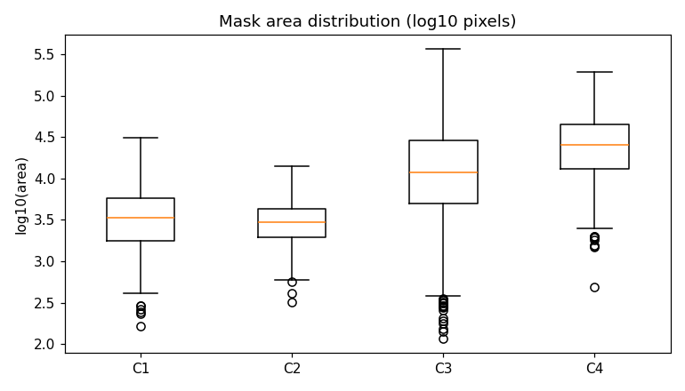
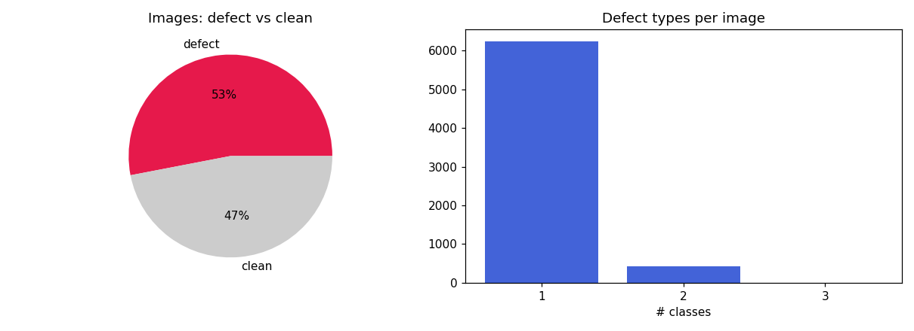

# EDA — Severstal Steel Defect Detection

> 자동 생성: `python -m src.eda`. 이미지 256×1600 그레이.

## 1. 이미지 수
- train 총 **12,568장**
- 결함 있는 이미지: **6,666** (53.0%)
- 정상(결함 0) 이미지: **5,902** (47.0%)

## 2. 클래스별 결함 인스턴스 (불균형)
| 클래스 | 개수 | 비율 |
|---|---|---|
| C1 (점상/얼룩) | 897 | 12.6% |
| C2 (희귀) | 247 | 3.5% |
| C3 (대형/스크래치) | 5,150 | 72.6% |
| C4 (압흔) | 801 | 11.3% |
| **합계** | **7,095** | 100% |

→ **극심한 불균형**: C3가 73%, C2는 3%뿐. 불균형비 ≈ **21:1**.

## 3. 멀티라벨 (한 이미지에 결함 종류 수)
| 결함 종류 수 | 이미지 | 
|---|---|
| 1종 | 6,239 |
| 2종 | 425 |
| 3종 | 2 |

→ **427장이 2종 이상** 동시 보유 → 단일라벨 4-분류는 문제정의 오류. **멀티라벨 마스크 필수**.

## 4. 대회 지표(이미지×클래스 mean-Dice) 관점
- 전체 (이미지×클래스) 쌍 = 12,568×4 = **50,272**
- 결함 있는 쌍: **7,095** (14.11%)
- **빈 마스크 쌍: 43,177 (85.89%)** — 미예측 시 Dice=1, 한 픽셀이라도 예측하면 Dice=0

→ 점수의 **86%가 '빈 마스크를 비워두기'**에서 나옴. **empty FP 억제(분류 게이트)가 핵심**.

## 5. 클래스별 마스크 면적(픽셀)
| 클래스 | n | median | mean | min | max | 이미지대비 median |
|---|---|---|---|---|---|---|
| C1 (점상/얼룩) | 897 | 3,326 | 4,361 | 163 | 31,303 | 0.81% |
| C2 (희귀) | 247 | 2,944 | 3,378 | 316 | 14,023 | 0.72% |
| C3 (대형/스크래치) | 5,150 | 11,954 | 25,496 | 115 | 368,240 | 2.92% |
| C4 (압흔) | 801 | 25,357 | 34,374 | 491 | 192,780 | 6.19% |

→ C3는 넓고, C1/C2는 작은 결함 → 작은 마스크일수록 후처리(min-size)·해상도 민감.

### 5b. min-size 후처리 가이드 (클래스별 면적 백분위)
| 클래스 | p1 | p5 | p10 | p25 | → min-size 후보 |
|---|---|---|---|---|---|
| C1 | 465 | 798 | 1,063 | 1,762 | ~p5(798) 이하 제거 검토 |
| C2 | 574 | 989 | 1,213 | 1,948 | ~p5(989) 이하 제거 검토 |
| C3 | 720 | 1,829 | 2,786 | 5,054 | ~p5(1,829) 이하 제거 검토 |
| C4 | 1,991 | 5,115 | 7,090 | 13,114 | ~p5(5,115) 이하 제거 검토 |

→ 예측 마스크가 클래스별 p5 면적보다 작으면 거짓양성일 확률↑ → val에서 min-size 튜닝.

### 5c. 마스크당 연결요소(결함 덩어리) 수
| 클래스 | median | mean | max |
|---|---|---|---|
| C1 | 2 | 3.4 | 20 |
| C2 | 1 | 1.3 | 4 |
| C3 | 2 | 2.9 | 27 |
| C4 | 2 | 2.4 | 18 |

→ C1/C3는 한 이미지에 덩어리 다수(점상·산발) → 인스턴스 분리/후처리 영향.

### 5d. 클래스 동시발생 (co-occurrence)
| | C1 | C2 | C3 | C4 |
|---|---|---|---|---|
| C1 | 897 | 37 | 93 | 0 |
| C2 | 37 | 247 | 16 | 1 |
| C3 | 93 | 16 | 5150 | 284 |
| C4 | 0 | 1 | 284 | 801 |

→ 대각=단독, 비대각=동시출현. 멀티라벨 학습 근거.

### 5e. 공간 분포 (결함 위치 편향)

| 클래스 | 좌1/3 | 중1/3 | 우1/3 |
|---|---|---|---|
| C1 | 43% | 29% | 28% |
| C2 | 44% | 33% | 23% |
| C3 | 29% | 39% | 32% |
| C4 | 30% | 36% | 34% |

→ 위치 편향이 크면 ROI/crop 전략, 균일하면 풀이미지 학습 유리.

### 5f. 밝기 누수 검증 (다른 팀 'RD밝고 LS어둡다' 주장 재현)
| 그룹 | 표본 평균밝기 | std |
|---|---|---|
| 정상 | 87.0 | 31.3 |
| C1 단독 | 81.1 | 26.5 |
| C2 단독 | 53.2 | 27.8 |
| C3 단독 | 89.1 | 33.5 |
| C4 단독 | 96.5 | 31.9 |

→ 클래스 간 밝기 평균차가 크면 모델이 **밝기 자체를 학습할 위험**(다른 팀 지적). 대응: 밝기정규화(CLAHE)·밝기증강으로 결함 텍스처에 집중.

## 6. Leak-free 분할 (이미지 단위)
- **이미지 단위 5-fold StratifiedKFold**(클래스조합 기준), `data/folds.csv` 저장.
- 패치는 학습편의일 뿐 — 평가는 원본 이미지 단위 → **인접 패치 누수 원천 차단**.

| fold | 정상 | 결함 |
|---|---|---|
| 0 | 1,181 | 1,333 |
| 1 | 1,180 | 1,334 |
| 2 | 1,180 | 1,334 |
| 3 | 1,180 | 1,333 |
| 4 | 1,181 | 1,332 |

## 7. 샘플 (클래스별 마스크 오버레이)

## 그림

