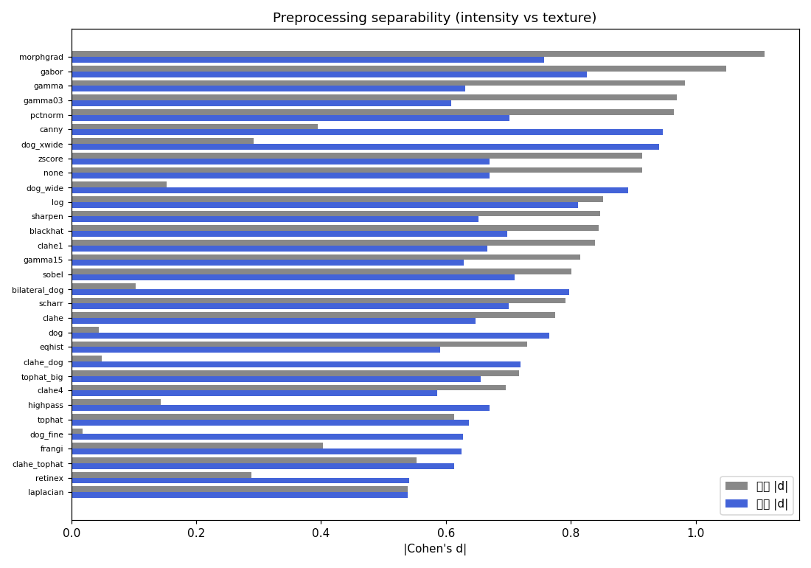

# 전처리 분리도 분석 (Cohen's d — 밝기 + 질감, 학습 불필요)

> 결함 vs 정상 픽셀 분리도. 클래스당 표본 60장. **밝기**=평균밝기차, **질감**=국소대비차(band-pass에 공정). 둘 중 큰 값으로 랭킹. *이건 prior일 뿐, 최종은 학습 스윕.*

| 전처리 | 밝기 |d| | 질감 |d| | max | C별 질감(C1/C2/C3/C4) |
|---|---|---|---|---|
| morphgrad | 1.11 | 0.76 | **1.11** | [0.85, 0.84, 0.81, 0.53] |
| gabor | 1.05 | 0.83 | **1.05** | [0.85, 0.98, 0.88, 0.59] |
| gamma | 0.98 | 0.63 | **0.98** | [0.62, 0.7, 0.68, 0.51] |
| gamma03 | 0.97 | 0.61 | **0.97** | [0.62, 0.65, 0.63, 0.53] |
| pctnorm | 0.97 | 0.70 | **0.97** | [0.72, 0.96, 0.69, 0.44] |
| canny | 0.39 | 0.95 | **0.95** | [0.91, 1.36, 0.9, 0.62] |
| dog_xwide | 0.29 | 0.94 | **0.94** | [0.95, 1.09, 0.99, 0.73] |
| zscore | 0.91 | 0.67 | **0.91** | [0.64, 0.9, 0.68, 0.46] |
| none | 0.91 | 0.67 | **0.91** | [0.64, 0.89, 0.68, 0.46] |
| dog_wide | 0.15 | 0.89 | **0.89** | [0.89, 1.1, 0.92, 0.66] |
| log | 0.85 | 0.81 | **0.85** | [0.8, 1.03, 0.82, 0.6] |
| sharpen | 0.85 | 0.65 | **0.85** | [0.62, 0.88, 0.66, 0.44] |
| blackhat | 0.84 | 0.70 | **0.84** | [0.67, 0.97, 0.69, 0.46] |
| clahe1 | 0.84 | 0.67 | **0.84** | [0.67, 0.91, 0.67, 0.42] |
| gamma15 | 0.81 | 0.63 | **0.81** | [0.58, 0.87, 0.65, 0.42] |
| sobel | 0.80 | 0.71 | **0.80** | [0.71, 0.91, 0.74, 0.49] |
| bilateral_dog | 0.10 | 0.80 | **0.80** | [0.76, 1.01, 0.83, 0.59] |
| scharr | 0.79 | 0.70 | **0.79** | [0.7, 0.89, 0.72, 0.48] |
| clahe | 0.77 | 0.65 | **0.77** | [0.67, 0.93, 0.63, 0.37] |
| dog | 0.04 | 0.77 | **0.77** | [0.75, 1.0, 0.78, 0.54] |
| eqhist | 0.73 | 0.59 | **0.73** | [0.67, 0.74, 0.51, 0.45] |
| clahe_dog | 0.05 | 0.72 | **0.72** | [0.74, 0.99, 0.7, 0.44] |
| tophat_big | 0.72 | 0.66 | **0.72** | [0.62, 0.9, 0.66, 0.45] |
| clahe4 | 0.70 | 0.59 | **0.70** | [0.64, 0.89, 0.54, 0.28] |
| highpass | 0.14 | 0.67 | **0.67** | [0.64, 0.89, 0.68, 0.46] |
| tophat | 0.61 | 0.64 | **0.64** | [0.61, 0.88, 0.63, 0.43] |
| dog_fine | 0.02 | 0.63 | **0.63** | [0.6, 0.87, 0.62, 0.41] |
| frangi | 0.40 | 0.62 | **0.62** | [0.6, 0.82, 0.63, 0.45] |
| clahe_tophat | 0.55 | 0.61 | **0.61** | [0.64, 0.91, 0.57, 0.33] |
| retinex | 0.29 | 0.54 | **0.54** | [0.55, 0.48, 0.58, 0.55] |
| laplacian | 0.54 | 0.54 | **0.54** | [0.52, 0.8, 0.52, 0.31] |

→ 기준선(none) max|d| = 0.91. **학습 스윕 권장(none 초과 상위)**: morphgrad, gabor, gamma, gamma03, pctnorm, canny, dog_xwide, zscore

⚠️ 이 지표는 prior(사전탐색)일 뿐 — DoG처럼 평균밝기를 없애는 전처리는 밝기|d|가 낮아도 질감|d|나 실제 학습에선 유효할 수 있음. **최종 선택은 밤샘 학습 스윕의 per-class 검출률로 결정.**

